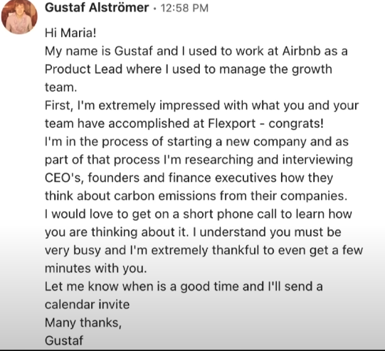
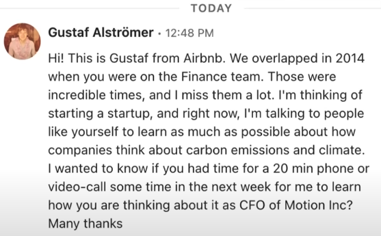

+++
title = 'Notes: How to talk to users'
date = 2024-03-07T23:05:44+01:00
draft = false
+++

<iframe width="560" height="315" src="https://www.youtube.com/embed/z1iF1c8w5Lg?si=IE2g4W1E2Fj9Xwar" title="YouTube video player" frameborder="0" allow="accelerometer; autoplay; clipboard-write; encrypted-media; gyroscope; picture-in-picture; web-share" allowfullscreen></iframe>

TODO ENDED AT 5:50

- startup ideas just does not happen on Lazy sunday morning
- How to talk to users
    - 01 Why the best founders talk to their users throughout the lifetime of the company
        - **Talk to customer even before you have product**
        - Users 
    - Who should you talk to
        - people in your network
        - coworkers 
        - people you don't know
            - linkedin
            - reddit
            - ...
            - in person events (meetups, make a meetup!)
    - process Starting a new startup
        - My plan
            - 01 Interview potential customers
            - 02 Learn about the problems & motivations around carbon emissions
            - 03 Understand what an MVP will look like (minimum viable product)
        - Speak with
            - founders, CEO's, CFO's at different sized companies
            - people that work in companies with titles that include carbon, climate, .. 
        - What l'm looking to learn
            - Does your company care about their carbon emissions?
            - Why do you care or not care?
            - Who in your company is relevant here?
        - Cold mails
            - People i know or don't know
                - 
                - 

    - 02 How to find your users and how to talk to them
    - 03 What questions to ask and not ask
    - 04 How to turn your conclusions into an